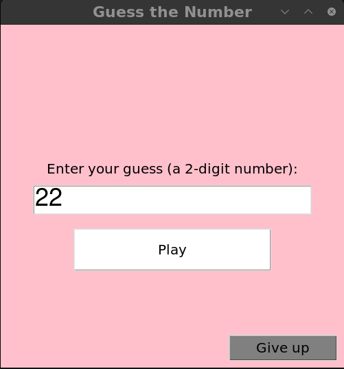
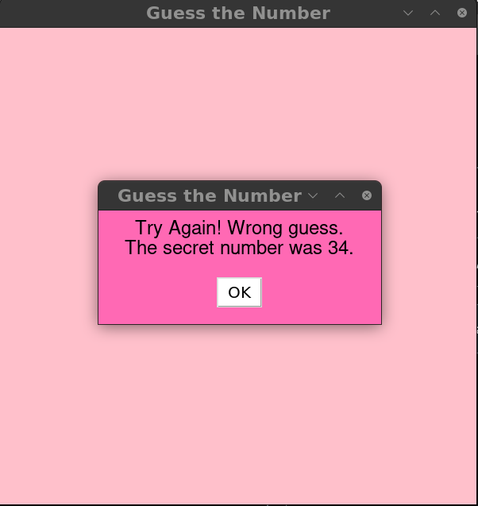

**Guess the Number**

This is a simple "Guess the Number" game built using Python's tkinter library for the GUI. The game generates a random two-digit number which the player tries to guess.

**How to Play**
  
  - Click "Start Game" to begin.
  
  - Enter a two-digit number as your guess.
  
  - Click "Play" to check your guess.
  
  - If you want to give up, click "Give up".

  

UPD: Added custom warning windows.

  

